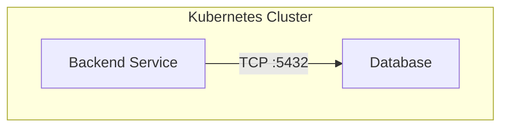
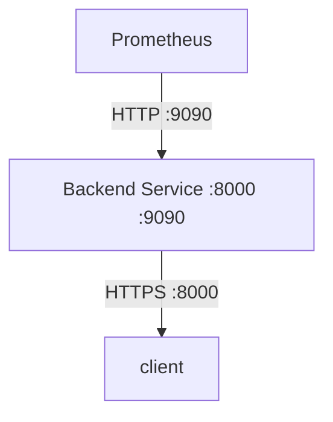
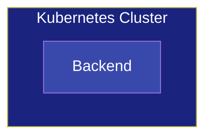
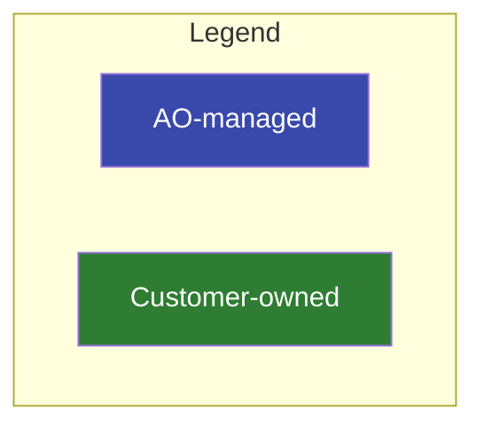

# Documentation Diagrams

Prescriptive rules for creating architecture diagrams and reference architecture documentation.

## Provenance

These patterns were established while producing reference architecture diagrams for a Kubernetes operator deployment (OpenShift). The source repository is not public.

Standards repository: <https://github.com/jewzaam/standards/>

## Mermaid Diagrams

### Node and Relationship Structure

Declare all nodes inside their subgraphs. Define ALL relationships (arrows) OUTSIDE of subgraphs.

Mermaid pulls connected nodes into the subgraph of the target when relationships are declared inside subgraphs. This causes unexpected node placement. Separating declarations from connections eliminates rendering assumptions.

**Do:**


**Don't:**
```mermaid
graph TD
    subgraph cluster["Kubernetes Cluster"]
        backend["Backend Service"]
        database["Database"]
        backend -->|"TCP :5432"| database  %% Inside subgraph - unpredictable placement
    end
```

### Port Labeling

Nodes show what they expose as part of the label. Arrows show protocol and port of the connection.

This handles components that expose multiple ports. The node shows what's available; the arrow shows which port/protocol is used for that specific connection.

**Example:**


### Colors and Styling

Use dark background fills with explicit white text (`color:#fff`). Light pastel backgrounds with default dark text are hard to read in many renderers.

Container subgraphs use a slightly darker shade than their children (same color family). This makes children visually pop without needing a separate legend entry.

**Example:**


### Legends

Add a `subgraph Legend["Legend"]` containing one node per ownership category. Style legend nodes with the same colors used in the diagram. Legend nodes map directly to diagram node colors.

Keep legend entries minimal (e.g., "AO-managed", "Customer-owned"). The diagram itself shows specifics.

**Example:**


## Supporting Documentation

### Connectivity Tables

Every architecture diagram must be paired with a markdown table:

| Source | Destination | Protocol | Port | Encrypted | Notes |

One row per connection. Include an explicit "Encrypted" column. Readers cannot infer encryption status from protocol alone (e.g., TCP to Redis is unencrypted despite being internal, gRPC to Temporal is mTLS). This column is critical for security review.

**Example:**
```markdown
| Source | Destination | Protocol | Port | Encrypted | Notes |
|--------|-------------|----------|------|-----------|-------|
| Backend | PostgreSQL | TCP | 5432 | No | Internal only |
| Backend | Temporal | gRPC | 7233 | Yes (mTLS) | Workflow execution |
| UI | Backend | HTTPS | 8000 | Yes (TLS) | API requests |
```

### Reference Architecture Structure

Use one base component table for what's common across all deployment variants. Add short delta sections per deployment variant describing only what differs.

Do not duplicate identical tables across deployment variants. Duplication makes maintenance painful and introduces drift.

**Structure:**
```markdown
## Common Components

| Component | Purpose | Resource Defaults |
|-----------|---------|-------------------|
| Backend | API server | 2 CPU, 4Gi RAM |
| Database | PostgreSQL | 4 CPU, 8Gi RAM |

## SNO Deployment

Differences from common components:
- Backend reduced to 1 CPU, 2Gi RAM
- Database runs externally (customer-managed)

## Production Deployment

Differences from common components:
- Backend scaled to 4 replicas
- Database uses operator-managed HA configuration
```

### Dependency Positioning

For bring-your-own dependencies (databases, storage, etc.), state "must be reachable from the cluster". Do not prescribe location (on-prem, cloud, in-cluster). The customer owns placement decisions.

**Do:**
"PostgreSQL must be reachable from the cluster on port 5432."

**Don't:**
"PostgreSQL should be deployed in the same availability zone" or "PostgreSQL runs as a pod in the cluster."

## Documentation Quality

### Citation Discipline

Link to upstream repository source lines for every factual claim (port numbers, resource defaults, protocol details). Verify links resolve before publishing.

Never use local filesystem paths in cross-repo references. Qualify any naked `.md` text with an explicit markdown link. Renderers auto-link bare `ARCHITECTURE.md` to `https://architecture.md/`.

**Do:**
```markdown
Backend exposes port 8000 ([source](https://github.com/org/repo/blob/main/config.py#L42)).
See [ARCHITECTURE.md](https://github.com/org/repo/blob/main/ARCHITECTURE.md) for details.
```

**Don't:**
```markdown
Backend exposes port 8000 (see backend/config.py).
See ARCHITECTURE.md for details.
```

### Validation Requirements

Deploy to a real cluster, capture actual state (`oc get`, `oc describe`), and verify claims against source code before documenting.

"The code says X" is not the same as "X is deployed". Both must be checked.

**Verification checklist:**

- Deploy to target environment
- Capture resource YAML (`oc get -o yaml`)
- Verify ports, protocols, resource limits match documentation
- Test connectivity paths described in diagrams
- Cross-check with source code definitions

### Internal vs Customer-Facing Documentation

Do not use internal architecture documents (operator PRDs, design docs) as the basis for customer-facing recommendations.

Internal docs describe how things work. Customer docs describe what customers need to do.

Reference internal docs for accuracy. Frame recommendations from the customer's perspective.

**Internal perspective:**
"The operator creates a PostgreSQL StatefulSet with anti-affinity rules to distribute replicas across zones."

**Customer-facing perspective:**
"Provide a PostgreSQL endpoint reachable from the cluster. For high availability, configure replication across availability zones."
